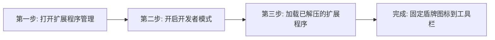

# 🛡️ ListSafe 插件用户使用与操作指南 (User Manual)

> **版本**：v2026.1  
> **适用平台**：Google Chrome / Microsoft Edge / Brave 等 Chromium 内核浏览器  
> **支持电商平台**：Etsy、Shopify、Amazon Merch / KDP、TikTok Shop 及独立站编辑后台

---

## 📑 目录
1. [产品简介与核心价值](#1-产品简介与核心价值)
2. [插件安装教程（图文步骤）](#2-插件安装教程图文步骤)
3. [核心功能与详细操作指南](#3-核心功能与详细操作指南)
   - [功能 A：打字实时侵权拦截与 1-Click 安全词替换](#功能-a打字实时侵权拦截与-1-click-安全词替换)
   - [功能 B：右下角悬浮安全仪表盘与一键修复 (Auto-Fix All)](#功能-b右下角悬浮安全仪表盘与一键修复-auto-fix-all)
   - [功能 C：顶部插件弹窗四大面板（体检/查词/设置/白名单）](#功能-c顶部插件弹窗四大面板体检查词设置白名单)
4. [风险词库更新机制与数据来源](#4-风险词库更新机制与数据来源)
5. [免费版 vs Pro 收费版的权益区别与定价](#5-免费版-vs-pro-收费版的权益区别与定价)
6. [多国语言切换指南 (支持 6 国语言)](#6-多国语言切换指南-支持-6-国语言)
7. [Pro 会员激活与测试方法](#7-pro-会员激活与测试方法)
8. [常见问题与使用技巧 (FAQ)](#8-常见问题与使用技巧-faq)

---

## 1. 产品简介与核心价值

**ListSafe** 是一款专为海外跨境电商卖家量身定制的**实时商标侵权拦截与店铺合规助手**。

### 为什么每个卖家都需要它？
* **避免无意识侵权封店**：很多日常词汇（如 *Boy Mom*, *Mama Bear*, *Onesie*, *Super Bowl*）已被恶意注册为商标，踩中即面临 DMCA 投诉或全店永久封禁；
* **无需跳出页面查词**：打字时自动监测，输入框下方即时提醒，无需在复杂的美国专利局（USPTO）网站来回切换；
* **自带合规流量词库**：提供经过人工和 AI 验证的安全同义词，点击一下自动替换。

---

## 2. 插件安装教程（图文步骤）

只需要 **3 步** 即可在 Chrome 或 Edge 浏览器中完成安装：



### 详细步骤：
1. **打开扩展管理页面**：
   * 在 Chrome 浏览器地址栏输入：`chrome://extensions` 并回车；
   * *(如果使用 Edge 浏览器，请输入 `edge://extensions`)*。
2. **开启开发者模式**：
   * 打开页面右上角的 **“开发者模式” (Developer mode)** 开关。
3. **加载插件文件夹**：
   * 点击左上角的 **“加载已解压的扩展程序” (Load unpacked)** 按钮；
   * 在弹出的窗口中选择本项目所在目录：
     ```text
     c:\Users\Haye\Desktop\Antigravity\ListSafe
     ```
   * 点击“选择文件夹”即可安装成功！
4. **固定插件图标（推荐）**：
   * 点击浏览器右上角拼图图标 🧩，找到 **ListSafe Guard**，点击图钉 📌 固定到工具栏。

---

## 3. 核心功能与详细操作指南

---

### 功能 A：打字实时侵权拦截与 1-Click 安全词替换

**触发场景**：在 Etsy、Shopify 或沙盒页面的 **标题 (Title)**、**标签 (Tags)** 或 **商品描述 (Description)** 输入框中输入文字。

```text
操作流程：
1. 当您在输入框输入文字时，ListSafe 会在 280 毫秒内自动完成后台比对；
2. 一旦发现高危商标（如 "Mama Bear"），输入框下方会立即弹出红色的【风险警示卡片】；
3. 卡片会清楚展示：
   - ⚠️ 命中的商标名称与持有人；
   - 📋 注册类别（如 Class 025 服装）；
   - 💡 推荐安全替换词（如 [+ Protective Mama], [+ Bear Mom Vibe]）；
4. 【核心操作】：直接鼠标点击任意绿色安全词按钮，输入框内的违规词会被自动平滑替换！
```

---

### 功能 B：右下角悬浮安全仪表盘与一键修复 (Auto-Fix All)

**触发场景**：打开任意商品编辑页面时，页面右下角会自动出现一个精致的悬浮安全卡片。

#### 核心状态与操作：
1. **0~100 分实时安全评分**：
   * 🟢 **85 ~ 100 分（绿色）**：Listing 100% 安全，无侵权风险，可放心点击发布；
   * 🟡 **50 ~ 84 分（黄色）**：检测到中等风险词或标签过长；
   * 🔴 **0 ~ 49 分（红色）**：检测到极高危侵权词，极易招致封店！
2. **✨ Auto-Fix All（一键全选替换为安全词）**：
   * 点击该按钮，插件会**一次性把标题、所有 13 个标签中的所有违规词全部自动替换为安全词**；
   * 修复完成后，评分瞬间跳回 100 分满分！
3. **收起与展开**：
   * 点击卡片右上角 `─` 可最小化为悬浮气泡；点击气泡随时重新展开。

---

### 功能 C：顶部插件弹窗四大面板（体检/查词/设置/白名单）

点击浏览器右上角的 **ListSafe 盾牌图标 🛡️**，即可打开控制中心：

| 选项卡 | 核心功能与使用方法 |
| :--- | :--- |
| **🛡️ Health Scan<br>(Listing 体检)** | • 查看当前活跃网页 Listing 的综合安全得分；<br>• 查看被拦截的高危词明细；<br>• **Etsy 标签检测器**：自动统计 13 个标签的使用情况，标红超过 20 字符的违规标签。 |
| **🔍 IP Lookup<br>(商标速查库)** | • 在搜索框输入任何词（如 `Barbie`、`Stanley`、`Jeep`、`Velcro`）；<br>• 可按服装（025）、首饰（014）、玩具（028）等类目和风险等级筛选；<br>• 查看避坑说明，并点击 **`复制安全词 📋`** 直接粘贴到商品标签中。 |
| **⚡ Pro & Setup<br>(会员与白名单)** | • **激活码核销**：输入 License 激活码解锁 Pro 专业特权；<br>• **累计数据**：查看已扫描 Listing 数量及成功规避的封店风险次数；<br>• **自定义安全白名单**：添加自己的注册品牌词（如 `mybrand`），插件将不再对其告警。 |

---

## 4. 风险词库更新机制与数据来源

为了确保卖家不受最新恶意抢注商标与突发诉讼的影响，ListSafe 建立了严密的三级更新体系：

### 🔄 更新频率与推送机制
* 🚨 **24 小时极速突发热更新 (Hot-Patch)**：当海外出现突发性律所大规模扫荡（如针对某节日热词的集中 DMCA 投诉），后台会在 24 小时内录入并静默推送到插件端；
* 🔄 **每周常规同步 (Weekly Sync)**：每周一定期同步美国专利商标局（USPTO）与世界知识产权组织（WIPO）最新审核通过生效的商品类别商标；
* 📦 **每月全量大版本发布 (Monthly Release)**：随 Chrome 官方商店更新全量离线数据库。

### 📡 4 大权威数据来源
1. **USPTO & WIPO 官方每周公报**：覆盖 Class 025（服装）、Class 014（首饰）、Class 021（家居杯具）、Class 028（玩具游戏）等全部出海核心类目；
2. **海外知名维权律所黑名单库**：收录 GBC、Keith、EPS 等律所的重点维权词清单；
3. **海外卖家社群实时情报监控**：持续抓取 Reddit（`r/EtsySellers`、`r/PrintOnDemand`）等社区中卖家真实踩雷下架案例；
4. **卖家众包一键上报**：用户遇到新型疑似侵权词可一键反馈，审核确认后极速纳入全球拦截库。

> [!NOTE]
> 词库更新为**云端静默热更新**，无需卖家手动重新安装或重启浏览器，系统在后台自动完成增量同步。

---

## 5. 免费版 vs Pro 收费版的权益区别与定价

ListSafe 采用“免费体验 + 专业版订阅”模式，全面满足从个人试用到专业矩阵大卖家的不同需求。

### 📊 功能权益对比清单

| 核心功能权益 | 免费体验版 (Free) | Pro 专业版 ($19/月 或 $149/年) |
| :--- | :---: | :---: |
| **打字实时侵权拦截** | ✅ 支持 (基础体验) | ✅ **无限次全天候实时守护** |
| **每日 Listing 体检上限** | 每天限 **3 个** Listing | 🚀 **无限制** (适合批量上架大卖家) |
| **单次手动词替换** | ✅ 支持 (单项点击替换) | ✅ 支持 |
| **✨ 1-Click 一键全选自动修复** | ❌ 不支持 (需逐个点击) | ⚡ **一键瞬间修复整篇 Listing 标题与标签** |
| **Etsy 13 标签合规与超长检测** | ✅ 基础检测 | ✅ **深度检测与字符超长高亮** |
| **高危商标速查库 (IP Lookup)** | ✅ 基础 50+ 经典词库查询 | 🔍 **全库 200+ 高危词库 + 类别深度筛选** |
| **风险商标库更新频率** | 随每月大版本更新 | 🔄 **每周/每日静默实时同步最新 USPTO 词库** |
| **突发律所扫荡 24h 极速推送** | ❌ 延迟更新 | 🚨 **24 小时内极速热更新护航** |
| **自定义安全白名单数量** | 最多添加 **3 个** 自有品牌词 | 🛡️ **无限制添加** 自有品牌与授权词 |
| **多平台支持** | 仅限 Etsy 单一平台 | 🌐 **全平台支持** (Etsy、Shopify、Amazon、TikTok Shop) |
| **适用人群** | 新手试用、月上架 <10 件的业余卖家 | **全职卖家、POD 批量铺货卖家、跨境工作室** |

### 💰 订阅定价方案 (由 Waffo.ai 提供全球合规收款)
* **Free 免费版**：`$0`（永久免费，适合刚入行卖家体验）；
* **Pro 月付版**：`$9.9 / 月`（灵活订阅，随时可取消，全店实时守护）；
* **Pro 年付版**：`$79 / 年`（相当于 `$6.5/月`，立省 35%）；
* **Agency / LTD 终身买断**：`$199 一次性买断`（支持最多 10 个店铺矩阵授权）。

> **💳 官方订阅链接**：[https://pancake.waffo.ai/store/xmaker-studio-p7o0nfzy/product/PROD_1Rwhe7sFXn5oqvh6kPBfNI?type=subscription&currency=USD](https://pancake.waffo.ai/store/xmaker-studio-p7o0nfzy/product/PROD_1Rwhe7sFXn5oqvh6kPBfNI?type=subscription&currency=USD)  
> 支持全球信用卡、Apple Pay、Google Pay 及本地化支付方式。支付成功后系统将即时生成专属 License 激活码。

---

## 6. 多国语言切换指南 (支持 6 国语言)

ListSafe 内置 6 国主流电商语言，切换方法如下：

1. **在插件弹窗中切换**：
   * 点击右上角扩展图标打开弹窗，在右上角下拉菜单中选择：
     * 🇨🇳 **简体中文**
     * 🇺🇸 **English**
     * 🇩🇪 **Deutsch**
     * 🇫🇷 **Français**
     * 🇪🇸 **Español**
     * 🇯🇵 **日本語**
2. **在测试沙盒中切换**：
   * 先在项目根目录运行 `python -m http.server 8000`，再打开 http://localhost:8000/demo/mock-etsy-editor.html （勿用 file:// 直接打开，浏览器会拦截本地词库加载），在顶部控制栏右上角直接切换语言；
3. 切换后，插件弹窗、悬浮仪表盘、输入框警示条及所有按钮文案将**即时无刷新更新**，并自动持久化保存您的语言偏好。

---

## 7. Pro 会员激活与测试方法

在插件弹窗的 **"⚡ Pro & Setup" (会员与设置)** 选项卡中，输入以下任意测试 License Key 即可立即激活 Pro 专业版：

* `LISTSAFE-PRO-2026`
* `ETSY-SAFE-PRO`
* `DEMO-VIP-2026`

---

## 8. 常见问题与使用技巧 (FAQ)

### Q1：插件会读取或泄露我的商品私密数据吗？
> **答：绝对不会。** ListSafe 采用纯客户端本地规则引擎计算，所有的文本扫描均在您的本地浏览器内完成，**不会将您的商品草稿、售价或私密词库上传到任何第三方服务器**，最大程度保护卖家的选品商业机密。

### Q2：我自己的注册品牌词被误报为侵权怎么办？
> **答**：点击插件图标进入 **"⚡ Pro & Setup"** -> 在 **“自定义安全白名单”** 中输入您的品牌词并点击添加，插件将永久忽略该词，不再提示风险。

### Q3：如果在没有真实 Etsy 账号的情况下如何测试体验？
> **答**：在项目根目录运行 `python -m http.server 8000` 后，打开 http://localhost:8000/demo/mock-etsy-editor.html，点击顶部的 `🚨 Case 1` 或 `🚨 Case 2` 预设，即可 1:1 完整体验所有功能！（请勿用 file:// 直接打开，浏览器会拦截本地词库加载。）
