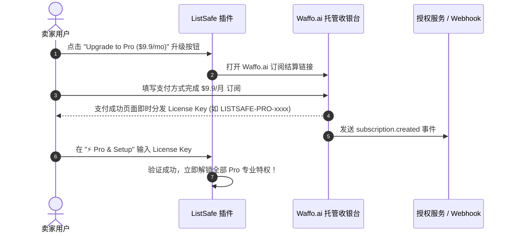
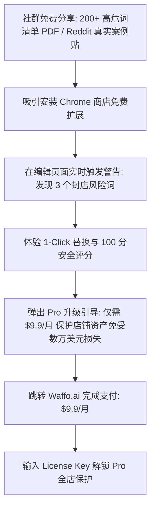

# 💰 ListSafe 商业化与变现全流程规划 (Monetization Playbook)

## 一、 定价与分层策略 (Tiered Pricing)

| 会员方案 | 价格 (USD) | 目标用户群 | 核心权益 |
| :--- | :--- | :--- | :--- |
| **Free 免费版** | **$0** | 新手试用、冷启动流量漏斗 | 每日可检测 3 次 Listing、基础商标库查询、单次手动替换 |
| **Pro 专业版 (月付)** | **$9.9 / 月** *(爆款普惠定价)* | 活跃 Etsy / POD / Shopify 卖家 | 无限次实时检测、1-Click Auto-Fix 一键全选替换、全店商品体检、最新 2026 商标库每周更新 |
| **Pro 专业版 (年付)** | **$79 / 年** *(相当于 $6.5/月，省 35%)* | 长期经营的全职卖家 | 包含 Pro 月付所有权益 + VIP 专属高危词提醒邮件推送 + 优先添加自定义词库 |
| **Agency / LTD 终身买断** | **$199 一次性买断** *(限时首发 100 名)* | 矩阵多店铺大卖家、外包团队 | 最多支持 10 个店铺授权、终身免费更新、快速回笼初期数千至数万美元现金流 |

---

## 二、 订阅支付平台对接方案 (Waffo.ai 实装已上线)

本项目采用 **Waffo.ai** 作为出海全球收款与订阅管理 Merchant of Record (MoR) 解决方案：

👉 **官方订阅结算链接**：  
`https://pancake.waffo.ai/store/xmaker-studio-p7o0nfzy/product/PROD_1Rwhe7sFXn5oqvh6kPBfNI?type=subscription&currency=USD`

### 🌟 为什么选择 Waffo.ai？
1. **无需自行处理全球税务与合规（VAT/Sales Tax）**：
   * Waffo.ai 作为 MoR 代管全球 173+ 个国家的自动算税、代扣代缴与发票合规。
2. **费率优势与低成本**：
   * 标准费率仅 **3.9% + $0.50**，无月费和开户费，极其适合出海 Micro-SaaS 与独立开发者。
3. **全球 300+ 本地化支付方式**：
   * 支持信用卡、Apple Pay、Google Pay 以及欧美/亚太/拉美多国本地钱包，大幅提升海外各区域卖家的订阅转化率。
4. **内置订阅与客户自助门户 (Customer Portal)**：
   * 用户可在 Waffo.ai 托管页面自主完成升级、续费、下载发票或取消订阅。

### 🔑 Waffo.ai 订阅与 License 激活流程：

---

## 三、 变现增长漏斗模型 (Conversion Funnel)

### 收益预测（以 500 个活跃付费用户为例）：
* 500 位付费卖家 × $9.9/月 = **$4,950 / 月（约合 ¥35,600 / 月的纯被动经常性收入）**
* $9.9/月的定价极大降低了卖家心理门槛，转化率预计提升 2.5~3 倍！由于插件为纯客户端轻量匹配，无高昂 GPU/服务器算力成本，净利润率依然稳定在 **92%~95%**！
